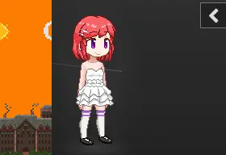
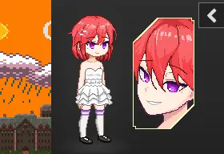
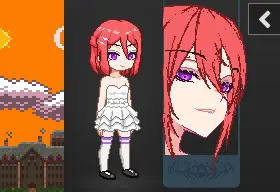

# Degrees of Lewdity 整合包发布库

## 简介
### 放在前面...
-  <b>游戏作者</b>
  
  - [Vrelnir 的博客][1]
  - [游戏 wiki (英文)][2]
  - [游戏源码仓库][3]
  - [汉化仓库][4]
  - [Degrees of Lewdity Graphics Mod][5]
  - [BEEESSS Community Sprite Compilation][6]
  - [韩站特写][7]
  - [Papa Paril BEEESSS Burger Joint][8]

### 关于本仓库

本仓库是基于 [汉化仓库][4] 制作的自动化打包仓库，使用 Github Actions 提供多种 Mod 组合可供选择，跟随汉化仓库更新

### 下载

[Latest Release](https://github.com/sakarie9/DOL-CHS-MODS/releases/latest)

### 各版本说明

- 美化 | [Degrees of Lewdity Graphics Mod][5] [BEEESSS Community Sprite Compilation][6]

  

  经典美化

- 作弊

  不需要在设置启动作弊即可使用作弊功能，可以解锁成就

- HP

  显示敌人当前 HP

- 特写1 | [原帖][7]

  

  在立绘旁显示特写头像

  ⚠️仍在早期开发阶段，未支持的头发会显示为光头⚠️

- 特写2 | [Papa Paril BEEESSS Burger Joint][8]

  

  另一个特写版本

  ⚠️仍在早期开发阶段，未支持的头发会显示为光头，目前支持的头发比特写1更少⚠️


### 更新日志
<details>
<summary>点击展开</summary>

- v1.3.0-0904

  修正特写2未被应用的问题

- v1.3.0-0903

  添加特写12及HP

- v1.3.0-0902
  
  首次更新

</details>

### 整合包使用须知

- 本整合包中 Android 端应用名称修改为 `DOL CHS MODS` 且与原版及汉化版共存，请使用导出存档功能转移存档

- 根据汉化仓库中的 [免责声明](https://github.com/Eltirosto/Degrees-of-Lewdity-Chinese-Localization/blob/main/README.md#%E5%85%8D%E8%B4%A3%E5%A3%B0%E6%98%8E)

    ```
    汉化组不对任何修改后的汉化版本负责，包括但不限于修改游戏本体html文件，使用可能改变游戏内容的mod，使用他人发布的整合包等；汉化组也不会为任何第三方发布的mod版/修改版/魔改版/整合包等背书或担保。请在反馈问题前检查游戏是否已被修改，若被修改请勿提交，我们可能不会接受使用修改版本的内容反馈。
    ```

    在使用本整合包出现问题时在未判断问题是否由本整合包引入之前请勿向汉化仓库反馈

[1]: https://vrelnir.blogspot.com/
[2]: https://degreesoflewdity.miraheze.org/wiki/Main_Page
[3]: https://gitgud.io/Vrelnir/degrees-of-lewdity/-/tree/master/
[4]: https://github.com/Eltirosto/Degrees-of-Lewdity-Chinese-Localization/
[5]: https://gitgud.io/BEEESSS/degrees-of-lewdity-graphics-mod
[6]: https://gitgud.io/Kaervek/kaervek-beeesss-community-sprite-compilation
[7]: https://arca.live/b/textgame/83875947
[8]: https://gitgud.io/GTXMEGADUDE/papa-paril-burger-joint